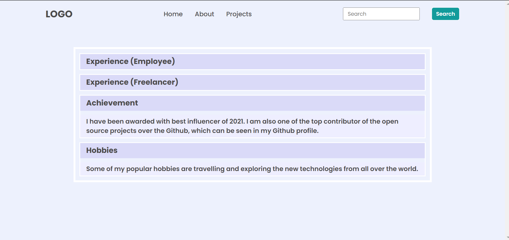

# iNeuron DOM Assignment 1

<br>

## Task 1

<br>

### Question: The user to append a new element in the navigation menu named "Hire me" after the projects.

<br>

### Output

<br>


<br>

### Solution

<br>

```Javascript
let ul = document.querySelector("header nav ul");
let li = document.createElement("li");
li.innerHTML = `<a href="#">Hire me</a>`;
ul.appendChild(li);

```

<br>

## Task 2

<br>

### Question: The user to change the search input placeholder text to "search" ==> "Search My Project"

<br>

### Output


<br>

### Solution

<br>

```javascript
let searchInput = document.querySelector(".search-field input");
searchInput.placeholder = "Search My Project";
```

<br>

## Task 3

<br>

### Question: The user to change the "a freelancer " to "an employee"and also change the company name to "iNeuron intelligence Pvt Ltd" in hero text section

<br>

### Output


<br>

### Solution

<br>

```javascript
let employee = document.querySelectorAll("span")[2];
employee.innerText = "An Employee";
```

<br>

## Task 4

<br>

### Question: The user to change the hero avtar image to new avatar image 

<br>

### Output

.png)

<br>

### Solution

```javascript
let img = document.querySelector(".hero-right-section img");
img.src = "./1677471918634.png";
```

## Task 5

<br>

### Question: The user to append a new btn element in the hero-right-section-btns class btn named "Support me"

<br>

### Output 


### Solution

<br>

```javascript
let btn = document.querySelector(".hero-right-section-btns");
let createBtn = document.createElement("button");
createBtn.innerText = "Support Me";
btn.appendChild(createBtn);
```
<br>

# Assignment 2

<br>

## Task 1

<br>

### Question: The user write the faq section javascript code

<br>

### Output



### Solution

<br>

```javascript
let accordian = document.querySelectorAll(".accordian h3");
accordian.forEach((element) => {
  element.addEventListener("click", () => {
    let para = element.nextElementSibling;
    if (para.style.display === "block") {
      para.style.display = "none";
    } else {
      para.style.display = "block";
    }
  });
});
```
<br>

## Task 2

<br>

### Question: The user need to add a new faq child named "Skills"

<br>

### Output


### Solution

<br>

```javascript
let acc = document.querySelector(".accordian-wrapper");
let newDiv = document.createElement("div");
newDiv.className = "accordian";
newDiv.innerHTML = `<h3>Skills</h3>
<p>I posses a very good command over Full Stack Development technologies like MERN which can be seen in my work over the GitHub.</p>`;
acc.appendChild(newDiv);

let accordian = document.querySelectorAll(".accordian h3");
accordian.forEach((element) => {
  element.addEventListener("click", () => {
    let para = element.nextElementSibling;
    if (para.style.display === "block") {
      para.style.display = "none";
    } else {
      para.style.display = "block";
    }
  });
});
```

<br>

## Assignment 3

<br>
<br>


